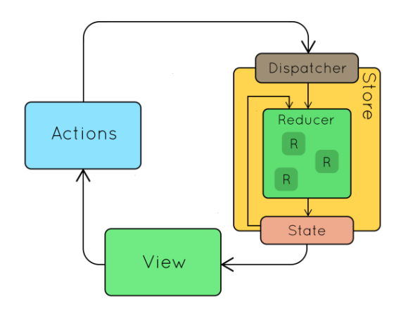

### 1. Redux là gì ? 

- Redux là 1 thư viện js sử dụng để quản lý state
- Redux sử dụng kiến trúc uni-directional data flow (data đi theo 1 chiều)

### 2. Kiến trúc của Redux ?


- Redux có 3 thành phần chính : `VIEW`, `ACTIONS`, `STORE`
- <b>VIEW</b>:
    + Đại diện cho các thư viện xử lý giao diện
    + Ví dụ : ReactJs, VueJS, AngularJS, hoặc Pure javascript
    
- <b>STORE</b>:
    + `STATE`: là dữ liệu hiện tại được lưu trên state
    + `Reducer` : là hàm biến đổi state cũ sang state mới
    + Dispatcher: công cụ để quản lý `middlewares` và chuyển dữ liệu xuống reducer
    
- <b>ACTION</b>:
    + là 1 plain javascript object
    + nhiệm vụ mô tả các hành động xảy ra
    
### 3. Các nguyên lý cơ bản của Redux

- Single source of truth (Nguồn dữ liệu tin cậy duy nhất) : State của toàn bộ ứng dụng được chứa trong 1 object tree nằm trong STORE duy nhất
- State is read-only (Trạng thái chỉ được phép đọc) : Cách duy nhất để thay đổi STATE của ứng dụng là tạo ra 1 ACTION và gọi nói
- Change are made with pure functions (Thay đổi chỉ bằng các hàm thuần túy) : Để chỉ ra cách mà STATE được biến đổi bởi ACTION chúng ta dùng các pure function gọi là REDUCER

### 4. Khi nào cần sử dụng Redux

- Dữ liệu được sử dụng ở nhiều nơi
- Cần cache dữ liệu để tái sử dụng cho các lần sau

### 5. Cài đặt redux trong react-app

- Mục tiêu : Tạo 1 app hiển thị các bài post bằng cách sử dụng react, redux và axios
  
- Cài đặt react-app 

```angular2svg
npx create-react-app redux-demo-app
```

- Cài đặt 2 thư viện: redux và redux-thunk, react-redux

```angular2svg
npm i redux redux-thunk react-redux --save
```

- <b>Step 1: Tạo Provider and Store trong index.js</b>

```angular2svg
import { Provider } from 'react-redux';
import { createStore, applyMiddleware } from 'redux';
import thunk from 'redux-thunk';

const store = createStore(reducers, applyMiddleware(thunk));
ReactDOM.render(
<Provider store={store}>
  <App />
</Provider>,
document.getElementById('root')
);
```

- <b> Step 2: Tạo Action : Lấy danh sách các bài post và thông tin user</b>

```angular2svg
import jsonPlaceholder from '../apis/jsonPlaceholder';

export const fetchPosts = () => (
    async (dispatch) => {
        const response = await jsonPlaceholder.get('/posts');
        dispatch({
            type: 'FETCH_POSTS',
            payload: response.data,
        });
    }
);

export const fetchUserById = (id) => async (dispatch) => {
    const response = await jsonPlaceholder.get(`/users/${id}`);
    dispatch({
        type: 'FETCH_USER',
        payload: response.data
    });
};


```
- <b>Step 3 : Tạo Reducer (Tạo thư mục reducer và file index.js)</b>

index.js
```angular2svg
import { combineReducers } from "redux";

export default combineReducers();
```

postReducer.js
```angular2svg
export default (state = [], action) => {
  switch (action.type) {
    case 'FETCH_POSTS':
      return action.payload;
    default:
      return state;
  }
```

- <b>Step 4 : Sử dụng Store trong component</b>

```angular2svg
const mapStateToProps = (state) => {
  return {
    posts: state.posts
  }
}

// export default connect(mapStateToProps, { fetchPostsAndUsers })(PostList);
// mapStateToProps : lấy các state từ store để component lấy dữ liệu đó hiển thị ra view
// mapDispatchToProps : lấy các Action truyền cho component, để user có thể tác động vào action -> từ action sẽ gọi reducer biến đổi state cũ thành state mới và trả về cho store
// Ở đây fetchPosts là 1 pure function và viết kiểu { fetchPosts } chính là return về 1 plain object
export default connect(mapStateToProps, { fetchPosts })(PostList);
```

```angular2svg
componentDidMount() {
    this.props.fetchPosts();
  }
```

### 6. Component Provider trong Redux

- Sử dụng để liên kết ứng dụng react với redux store
- Provider là 1 component của react được cung cấp bởi thư viện react-redux. Nó dung cho
mục đích duy nhất đó là cung cấp store cho những component con của nó
  
### 7. Hàm - connect trong Redux

- Provider có nhiệm vụ cung cấp STORE cho toàn bộ app
- connect : có nhiệm vụ kết nối tất cả các component đến với store dễ dàng hơn.
- Các tham số của hàm connect
- `mapStateToProps` (tham số thứ nhất)
    + Dùng để map State của Store với Props của Component
    + Được gọi mỗi khi State của Store thay đổi
    + Nhận toàn bộ State của store và trả về object data mà component cần
- `mapDispatchToProps` (tham số thứ 2)
    + Dùng để mapping method của Action tới method của Component
    + Thực hiện dispatch Action đến Store (Đây chính là cách duy nhất để thay đổi state)

### 8. Bài tập về nhà

- Tạo 1 ứng dụng react bằng create-react-app
- Cài đặt redux-thunk
- Xâu dựng 1 trang hiển thị các sản phẩm và có thể click buy từng sản phẩm hiển thị trong giỏ hàng